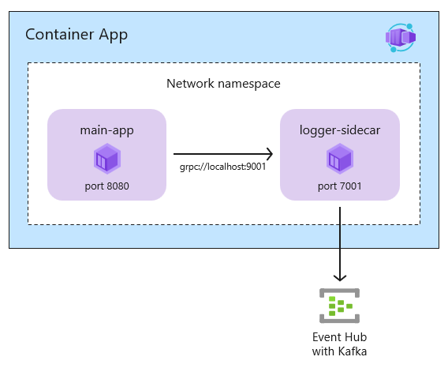
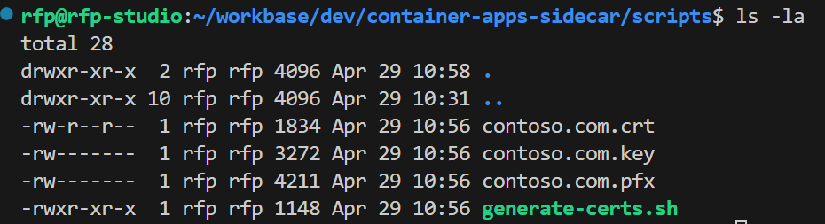

# Container Apps with Sidecar using Grpc and Kafka (Event Hubs)

This is a simple example of a containerized application that uses 2 containers, the main application and a sidecar to logs events to a Kafka (Event Hubs) server. The application is written in .Net and uses the gRPC framework to communicate with the sidecar. The sidecar is written in .Net and uses the Confluent Kafka client to communicate with the Kafka server (Azure Event Hubs).



## Generate certiticates

Grpc uses HTTPS and requires TLS. The following commands generate self-signed certificates required for the application.

```bash
scripts/generate-certs.sh
```

Sample output:




## Build


## Run and test locally

```bash
docker-compose up

curl -k https://localhost:5001/hello
```

docker exec -it container-apps-sidecar_main-app_1 /bin/bash

apt-get update && apt-get install -y curl

curl http://main-app:8080/albums


