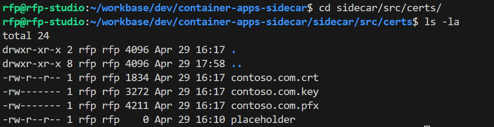

# Container Apps with Sidecar using Grpc and Kafka (Event Hubs)

This is a simple example of a containerized application that uses 2 containers, the main application and a sidecar to logs events to a Kafka (Event Hubs) server. The application is written in .Net and uses the gRPC framework to communicate with the sidecar. The sidecar is written in .Net and uses the Confluent Kafka client to communicate with the Kafka server (Azure Event Hubs).


## Generate certificates

Grpc uses HTTPS and requires TLS. The following commands generate self-signed certificates required for the application.

```bash
scripts/generate-certs.sh
```

Sample output:




## Run and test locally

Copy the file `sample.env` to `.env` and update the values with your own.

Build the container images locally using the provided script:
    
```bash 
scripts/build-locally.sh
```

Run it using docker-compose:

```bash
docker-compose up
```


You can check the running containers:


Attach to one of the containers:

```bash
docker exec -it container-apps-sidecar_main-app_1 /bin/bash
```

And install and run curl to test the endpoint:
```bash
apt-get update && apt-get install -y curl

curl http://main-app:8080/albums
```


You can check the output logs in the docker-compose output:


## Deploy to Azure Container Apps

As a pre-requisite you need to have an Azure Resource Group and an Azure Container Registry to where the container images will be published. Use the provided script to create your own:

```bash
scripts/create-acr.sh
```

And publish the images to it:

```bash
scripts/build-push-images.sh
```

Sample:


Now customize your `scripts/bicep/main.parameters.json` with your container registry name and then you can deploy the application to Azure Container Apps using the provided script:

```bash
scripts/deploy-aca.sh
```
## Check Container Apps

Navigate to your Container App, copy and paste the URL in a browser. You should see the list of albums:


Check the main app `albumapi` container logs:


Check the sidecar `utilitysidecar` container logs:


And finally you can check the event sent to the Event Hub:


## Main remarks

### 1. Implement a retry policy in the main app

When the main app tries to connect to the sidecar using Grpc, it's a best practice to define a Retry policy. One of the reasons is that the sidecar may not be available yet when the main app starts. The following code snippet shows how to implement a retry policy in the main app:

```csharp
static GrpcChannel CreateChannel(string grpcServerUri)
{
    // Retry policy for gRPC client
    var methodConfig = new MethodConfig
    {
        Names = { MethodName.Default },
        RetryPolicy = new RetryPolicy
        {
            MaxAttempts = 5,
            InitialBackoff = TimeSpan.FromSeconds(0.5),
            MaxBackoff = TimeSpan.FromSeconds(0.5),
            BackoffMultiplier = 1,
            RetryableStatusCodes = { StatusCode.Unavailable }
        }
    };

    // Return "true" to allow certificates that are untrusted/invalid
    var httpHandler = new HttpClientHandler
    {
        ServerCertificateCustomValidationCallback =
            HttpClientHandler.DangerousAcceptAnyServerCertificateValidator
    };

    return GrpcChannel.ForAddress(grpcServerUri, new GrpcChannelOptions
    {
        ServiceConfig = new ServiceConfig { MethodConfigs = { methodConfig } },
        HttpHandler = httpHandler
    });
}
```

### 2. Fire and forget

When the main app sends a message to the sidecar, it's a best practice to use the "fire and forget" pattern, to avoid the need to wait for a response that may impact the overall performance.
